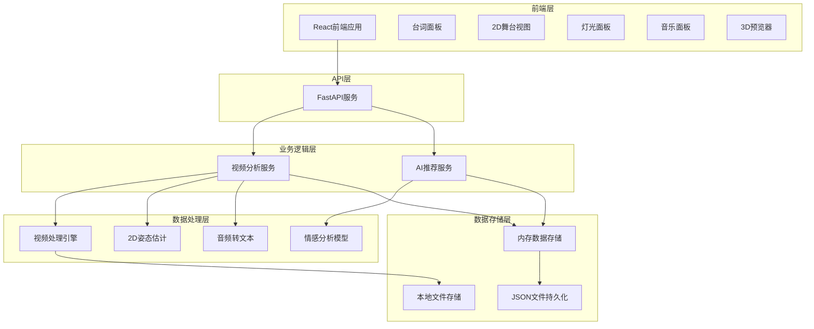

# 设计文档

## 概述

AI舞台系统采用简化的前后端分离架构，专为黑客松快速开发设计。后端使用FastAPI提供RESTful API，前端使用React构建美观的交互界面。系统核心功能包括视频分析、AI推荐和3D可视化，使用内存存储和JSON文件实现数据持久化。

## 架构

### 整体架构（MVP简化版）



### 技术栈选择（MVP版本）

**后端技术栈：**
- FastAPI：轻量级Web框架，快速API开发
- OpenCV + MediaPipe：视频处理和2D人体姿态估计
- Whisper：音频转文本（或使用在线API）
- Transformers：预训练情感分析模型
- JSON：数据序列化和文件存储
- 本地文件系统：视频和资源存储

**前端技术栈：**
- React 18 + TypeScript：类型安全的用户界面
- Ant Design：现代化UI组件库
- Three.js：3D场景渲染和可视化
- Canvas API：2D舞台视图绘制
- Axios：HTTP客户端
- React Context：状态管理

## 组件和接口

### 核心组件

#### 1. 视频分析引擎 (VideoAnalysisEngine) - 简化版

```python
class VideoAnalysisEngine:
    def __init__(self):
        self.pose_estimator = MediaPipePoseEstimator()
        self.audio_processor = WhisperAudioProcessor()
        self.data_store = InMemoryDataStore()
    
    async def process_video(self, video_path: str) -> AnalysisResult:
        """处理视频并提取音频和2D位置信息"""
        pass
    
    async def extract_audio_transcript(self, video_path: str) -> List[TranscriptSegment]:
        """提取音频并转换为带时间戳的文本"""
        pass
    
    async def extract_actor_positions_2d(self, video_path: str) -> List[ActorPosition2D]:
        """提取演员2D位置坐标（简化版，跳过3D重建）"""
        pass
```

#### 2. AI推荐引擎 (AIRecommendationEngine)

```python
class AIRecommendationEngine:
    def __init__(self):
        self.emotion_analyzer = EmotionAnalyzer()
        self.spatial_analyzer = SpatialAnalyzer()
        self.lighting_recommender = LightingRecommender()
        self.music_recommender = MusicRecommender()
    
    async def generate_movement_suggestions(self, stage_data: StageData) -> List[MovementSuggestion]:
        """基于舞台空间和台词生成走位建议"""
        pass
    
    async def recommend_lighting_scheme(self, transcript: List[TranscriptSegment]) -> LightingScheme:
        """基于台词情感分析推荐灯光方案"""
        pass
    
    async def suggest_music_cues(self, transcript: List[TranscriptSegment]) -> List[MusicCue]:
        """推荐音乐切换点"""
        pass
```

#### 3. 内存数据存储管理器 (InMemoryDataStore)

```python
class InMemoryDataStore:
    def __init__(self):
        self.projects = {}
        self.videos = {}
        self.transcripts = {}
        self.actor_positions = {}
        self.lighting_cues = {}
        self.music_cues = {}
    
    def save_to_json(self, file_path: str):
        """将内存数据保存到JSON文件"""
        pass
    
    def load_from_json(self, file_path: str):
        """从JSON文件加载数据到内存"""
        pass
    
    def get_project_data(self, project_id: str) -> Dict:
        """获取项目的所有相关数据"""
        pass
```

### API接口设计

#### 视频分析API

```python
# POST /api/video/upload
async def upload_video(file: UploadFile) -> VideoUploadResponse

# GET /api/video/{video_id}/analysis
async def get_analysis_result(video_id: str) -> AnalysisResult

# POST /api/video/{video_id}/reprocess
async def reprocess_video(video_id: str, options: ProcessingOptions) -> TaskResponse
```

#### AI推荐API

```python
# POST /api/ai/movement-suggestions
async def get_movement_suggestions(request: MovementRequest) -> List[MovementSuggestion]

# POST /api/ai/lighting-recommendations
async def get_lighting_recommendations(request: LightingRequest) -> LightingScheme

# POST /api/ai/music-cues
async def get_music_cues(request: MusicRequest) -> List[MusicCue]
```

#### 舞台管理API

```python
# GET /api/stage/{stage_id}
async def get_stage_data(stage_id: str) -> StageData

# PUT /api/stage/{stage_id}/actors/{actor_id}/position
async def update_actor_position(stage_id: str, actor_id: str, position: Position2D) -> UpdateResponse

# POST /api/stage/{stage_id}/props
async def add_stage_prop(stage_id: str, prop: StageProp) -> PropResponse
```

## 数据模型

### 核心数据结构

```python
@dataclass
class TranscriptSegment:
    text: str
    start_time: float
    end_time: float
    speaker_id: Optional[str]
    confidence: float
    emotion: Optional[str]

@dataclass
class ActorPosition:
    actor_id: str
    timestamp: float
    position_2d: Position2D
    position_3d: Position3D
    confidence: float

@dataclass
class Position2D:
    x: float
    y: float

@dataclass
class Position3D:
    x: float
    y: float
    z: float

@dataclass
class MovementPath:
    actor_id: str
    waypoints: List[Waypoint]
    duration: float

@dataclass
class Waypoint:
    position: Position2D
    timestamp: float
    action: Optional[str]

@dataclass
class LightingCue:
    timestamp: float
    lights: List[LightState]
    transition_duration: float

@dataclass
class LightState:
    light_id: str
    color: RGB
    intensity: float
    position: Position3D

@dataclass
class MusicCue:
    timestamp: float
    action: str  # "start", "stop", "fade_in", "fade_out"
    track_id: Optional[str]
    volume: float
    fade_duration: float
```

### JSON数据结构（MVP版本）

```json
{
  "project": {
    "id": "project_uuid",
    "name": "项目名称",
    "description": "项目描述",
    "created_at": "2024-01-01T00:00:00Z"
  },
  "videos": [
    {
      "id": "video_uuid",
      "filename": "stage_video.mp4",
      "file_path": "./uploads/stage_video.mp4",
      "duration": 120.5,
      "fps": 30,
      "resolution": "1920x1080",
      "status": "processed"
    }
  ],
  "actors": [
    {
      "id": "actor_uuid",
      "name": "演员A",
      "color": "#FF5733"
    }
  ],
  "transcripts": [
    {
      "id": "transcript_uuid",
      "video_id": "video_uuid",
      "actor_id": "actor_uuid",
      "text": "台词内容",
      "start_time": 10.5,
      "end_time": 15.2,
      "confidence": 0.95,
      "emotion": "positive"
    }
  ],
  "actor_positions": [
    {
      "id": "position_uuid",
      "video_id": "video_uuid",
      "actor_id": "actor_uuid",
      "timestamp": 10.5,
      "x_2d": 100.0,
      "y_2d": 200.0,
      "confidence": 0.9
    }
  ],
  "lighting_cues": [
    {
      "id": "lighting_uuid",
      "timestamp": 10.5,
      "lights": [
        {
          "light_id": "light_1",
          "color": {"r": 255, "g": 100, "b": 50},
          "intensity": 0.8
        }
      ],
      "transition_duration": 2.0
    }
  ],
  "music_cues": [
    {
      "id": "music_uuid",
      "timestamp": 10.5,
      "action": "start",
      "track_id": "background_music_1",
      "volume": 0.7,
      "fade_duration": 1.0
    }
  ]
}
```

## 错误处理

### 错误分类和处理策略

1. **视频处理错误**
   - 文件格式不支持：返回明确的错误信息和支持的格式列表
   - 视频损坏：提供修复建议或要求重新上传
   - 处理超时：实现断点续传和进度恢复

2. **AI推理错误**
   - 模型加载失败：提供降级方案或手动模式
   - 推理超时：实现异步处理和结果缓存
   - 结果置信度低：提供警告并允许手动调整

3. **数据同步错误**
   - API请求失败：重试机制和错误提示
   - 数据不一致：简单的数据刷新策略
   - 网络延迟：基础的加载状态指示

### 错误响应格式

```python
@dataclass
class ErrorResponse:
    error_code: str
    message: str
    details: Optional[Dict[str, Any]]
    timestamp: datetime
    request_id: str
```

## 测试策略

### 单元测试

- **视频处理模块**：测试各种视频格式和质量
- **AI推荐模块**：测试不同场景下的推荐准确性
- **数据同步模块**：测试并发更新和冲突解决

### 集成测试

- **端到端工作流**：从视频上传到最终预览的完整流程
- **基础协作**：简单的数据同步测试
- **性能测试**：基础的文件处理和响应时间测试

### 前端测试

- **组件测试**：各个UI组件的功能和交互测试
- **用户体验测试**：拖拽操作、时间轴同步等交互测试
- **跨浏览器兼容性**：确保在主流浏览器中正常工作

## 性能优化

### 后端优化（MVP版本）

1. **异步处理**：使用FastAPI的异步特性处理视频分析任务
2. **内存管理**：合理的内存使用和数据清理策略
3. **文件处理**：简单的文件上传和本地存储
4. **错误处理**：基础的异常捕获和用户友好的错误信息

### 前端优化（MVP版本）

1. **组件优化**：React组件的合理拆分和状态管理
2. **Canvas渲染**：2D舞台视图的基础渲染优化
3. **3D性能**：Three.js的基础场景优化
4. **用户体验**：加载状态和进度指示器

### AI模型优化（MVP版本）

1. **模型选择**：使用轻量级预训练模型
2. **简化推理**：基于规则的推荐算法结合AI分析
3. **结果缓存**：简单的结果缓存机制
4. **降级方案**：AI失败时的手动模式